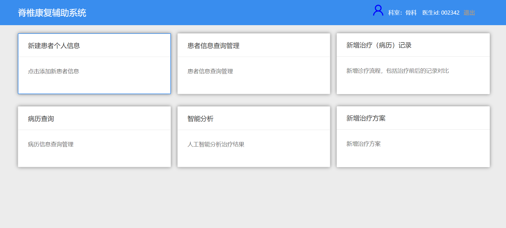
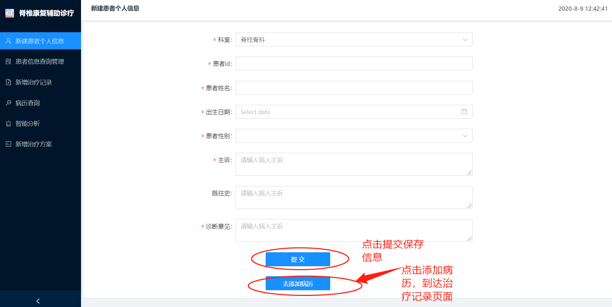
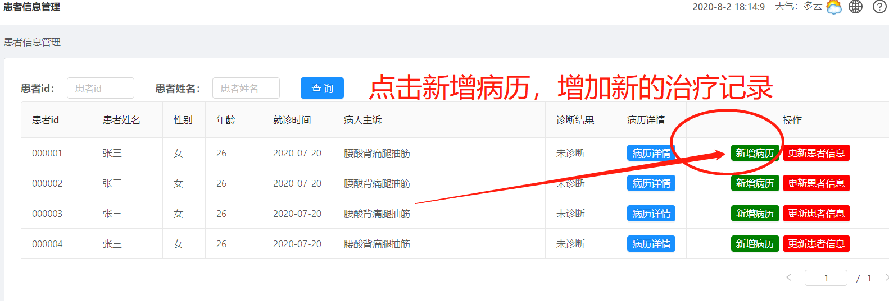
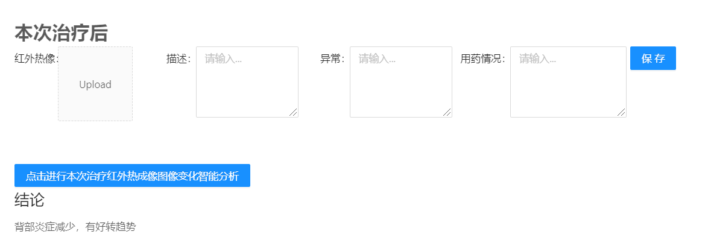
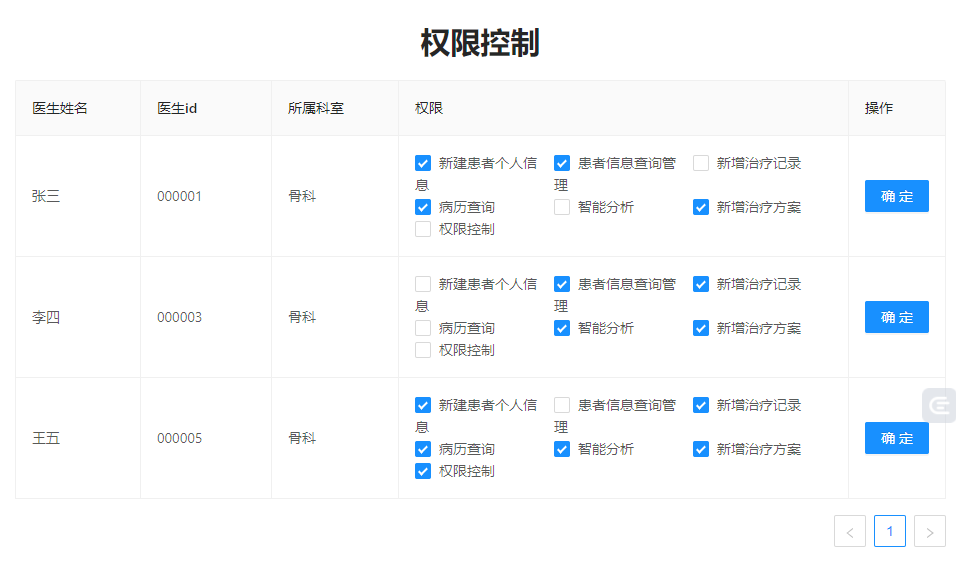

# 脊椎康复辅助诊疗系统平台操作指南

## 操作流程说明
（其中所有的操作逻辑页面都可以从首页直接到达，操作权限根据医生的id进行控制）
- 对于新患者：新建患者基本信息===>新增患者治疗记录及单次分析效果==>患者信息查询管理==>病历信息查询管理==>智能分析得到总体治疗效果。
- 对于老患者：患者信息查询管理===>新增患者治疗记录及单次分析效果==>病历信息查询管理==>智能分析得到总体治疗效果。

## 一、登录页
首先进入系统的登录页面，输入用户名、密码、验证码，登录到系统中的首页。

## 二、系统首页
系统首页分为6个模块，每个模块对应医生的操作流程，在需要进行相应的操作时，可以点击对应的模块直接到达逻辑操作页面，方便快捷。

权限控制：其中医生登录后，右上角显示科室和医生信息，医生之后所能够操作的权限都经过医生的id进行限制。

## 三、新建患者个人信息页面
对于新患者，需要先将患者的基本个人信息进行记录保存，点击“提交”将患者信息存储到数据库中，点击“去添加病历”到达患者本次治疗的记录分析页面。

## 四、患者信息查询管理
对于老患者，医生也可以直接从首页到达患者信息查询管理页面，进行操作管理。

新增治疗记录：点击“新增病历”，到达治疗记录和分析页面，增加新的治疗记录，会将新的治疗记录对比内容存入数据库中。

## 五、添加本次治疗记录分析页面
包括患者的个人基本信息，历史治疗记录的展示，以及本次治疗前、中、后的记录，分析。
- 本次治疗前：上传红外热图像，服药情况，以及相应的说明。
- 本次治疗：选择或者新增治疗方案进行治疗，并记录相应的备注说明。
- 本次治疗后：上传红外热图像，以及相应的说明。
本次治疗结束，点击进行本次治疗红外热成像变化智能分析，得到本次治疗效果的客观报告。

## 六、病历查询管理
病历信息查询：在病历信息查询页面，通过输入病历的id，可以查询到病历数据。

## 七、智能分析
对患者的多次治疗所记录的红外热成像以及相应的用药说明进行分析，得到智能分析的图形结果和文字说明，从客观上反应患者多次治疗的整体效果。

## 八、权限控制
根据医生的科室，对医生的权限进行控制。
